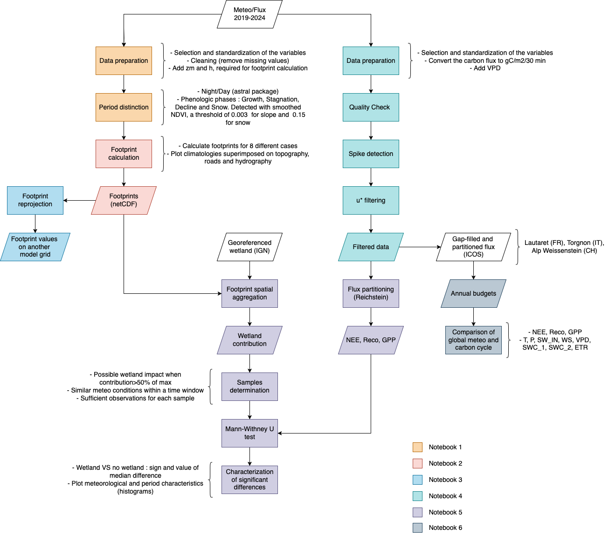

# Project "ICOS data and modeling at Col du Lautaret"

As carbon dioxide (CO2) concentration into the amosphere is increasing, causing global warming, the mitigation of its negative impacts becomes essential. Acting as natural carbon sinks, grasslands sequester up to 300 kg of carbon per hectare per year. However, their role and long-term sustainability could be threatened, especially in the Alps where the global warming is occurring faster. To understand the exchanges of CO2 and H2O between the ecosystem and the atmosphere, the IGE (Institute of Environmental Geosciences) supervises an ICOS-associated flux tower at Col du Lautaret (France). Installed on an alpine grassland characterized by varied plant species and topography, the main problematic is: **to what extent spatial heterogeneity around Lautaret affects the representativeness of the CO2 fluxes measured for the alpine grassland ?** To answer this question, flux footprint models can be used to describe the spatial extent and position of the surface area that is contributing to flux measurements.

### Author and contributors
Main author : Alise ROBERT (alise.robert@agrosupdijon.fr)  
Supervised by : Didier VOISIN (didier.voisin@univ-grenoble-alpes.fr)

---

## Objectives

The goals of this work are:  
- **To characterize the fluxes origin depending on different periods**  
- **To determine the contribution of certain areas (road, wetland, ...) to the measured CO2**  
- **To facilitate the comparison with other models, in particular hydrological**
- **To evaluate the annual carbon budgets and compare the observed functioning of the ecosystem with other similar stations**

---

## Usage 

Before running the notebook, the mentioned computing environment must be installed (**`environment.yml`**).  
Each notebook represents one step, as depicted in the following flowchart :

    

### 1. Importation and preparation of Lautaret data

**Inputs**: half-hourly meteorological and fluxes variables for the Lautaret station, following ICOS standards. As some measurements are missing for footprint calculation on the ICOS data portal (https://data.icos-cp.eu/portal/), raw csv files and metadata are used :
- 'FR-CLt_20.._Lofreq.csv' files contain half-hourly meteorological variables for each year.   
- 'FR-CLt_20.._flux.csv' files contain half-hourly eddy covariance fluxes information.  
The list of all the variables (code, units and description) are available on : https://docs.google.com/spreadsheets/d/1nSC75s6PU6I0Nge2MktXGMTtqob-Izsxld7t01b8Q6U/edit?gid=0#gid=0  
- 'zsensor.csv' contains the eddy covariance sensor height (in meters) and the dates of height change.  
- '20.._Lautaret_halfhour.csv' files are imported to get the NDVI values measured by the Skye sensor (`NDVI_skye_ref`).    
**Outputs**: plots (windroses for Day/Night, vegetation phases based on smoothed NDVI) and a csv file `flux_NDVI.csv` with all the required variables for flux footprint calculation.

### 2. Calculate footprints climatologies for the different phases, with contours from 10 to 90%

**Inputs**:  
- `flux_NDVI.csv`  
- 'MNS2m_jardin.tif' is a digital surface model (raster) containing georeferenced elevation data for the Col du Lautaret site.  
Based on `calc_footprint_FFP_climatology`of Kljun et al. (2015), `run_FFP_90` allows you to calculate the footprint climatology (aggregation of footptints over several time steps) for each specific period. To plot an example figure for the footprint climatology, you can set the parameter _fig_ to 1.  
**Outputs**: plots (climatologies with terrain characteristics, information on invalid timestamps), interactive html maps with climatology and windrose. **The main output data of this notebook are daily netCDF files (`data_to_daily_nc` function). For each day, a file following CF-1.8 convention is saved with full metadata. It contains footprint values on a x/y grid, for each timestamp and the characteristics of timestamps (night or day-time/vegetation phase).   
Warning : this last cell is particularly time-consuming, only run it if necessary**

### 3. Reproject the footprint onto another grid

**Inputs**:  
- `flux_NDVI.csv`  
-  'Mask_10m_adj.tif' is a raster containing the grid of the hydrological model "Parflow" for the Charmasses watershed.  
**Outputs**: This notebook provides an example of a footprint climatology reprojection. In the future, building an elaborate function will facilitate the comparison between measured and modeled data.

### 4. Postprocessing procedure on eddy-covariance data

**Inputs**:  
- 'FR-CLt_20.._Lofreq.csv' and 'FR-CLt_20.._flux.csv' files  
**Outputs**: a csv file `filtered_data.csv` with the filtered eddy-covariance data (Quality Check, spike detection, U* filtering).

### 5. Relative contribution of the wetland to the dynamics of carbon

**Inputs**:  
- 'SURFACE_HYDROGRAPHIQUE.shp', the hydrographic surfaces georeferenced by IGN in BD TOPO for Hautes-Alpes (https://geoservices.ign.fr/telechargement-api/BDTOPO)
-  `flux_NDVI.csv`
-  `filtered_data.csv`
**Outputs**: `relativecontributionZH_20_24.csv`containing the contribution of the wetland to the observed flux for each timestamp (sum of footprint values), and plots representing   

---

## Material

- **`notebooks/`** - executable Jupyter notebook
- **`plots/`** - output plots
- **`report/`** - context, material and bibliography of this work
- **`scripts/`** - modules used in the notebook
- **`utils/`** - complementary module for single footprint calculation

---

## Licenses and accessibility

The code and this repository are licensed under the MIT License. See the [MIT_LICENSE](MIT_LICENSE) file for details.
The input (csv) and output data (netCDF and figures) are licensed under a Creative Commons Attribution 4.0 International license (https://creativecommons.org/licenses/by/4.0/legalcode). 
This project uses the footprint model by Kljun et al. (2015), which is licensed under the ISC License. See [ISC_MODEL_LICENSE](ISC_MODEL_LICENSE) for details.  

The data and scripts are shared under open licenses that support the principles of open science. This ensures that others can freely access, use and build upon the material for any purpose, promoting reproducibility and collaborative research while still giving the original authors appropriate credit.  

**Conservation strategies:** For now, output datasets and figures will be used as part of the internship deliverables and are not meant to be stored on a public repository like Zenodo. In the long term, the code could be adapted for more general use and applied for other ICOS stations. Then it will be stored on software heritage or zenodo.

---

## Acknowledgments

Kljun et al. (2015) for the footprint model  
Pedro Coimbra (https://github.com/pedrohenriquecoimbra/FluxPrint)